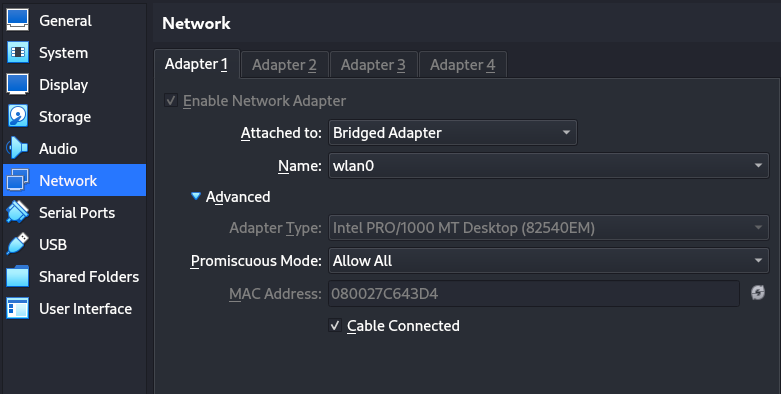
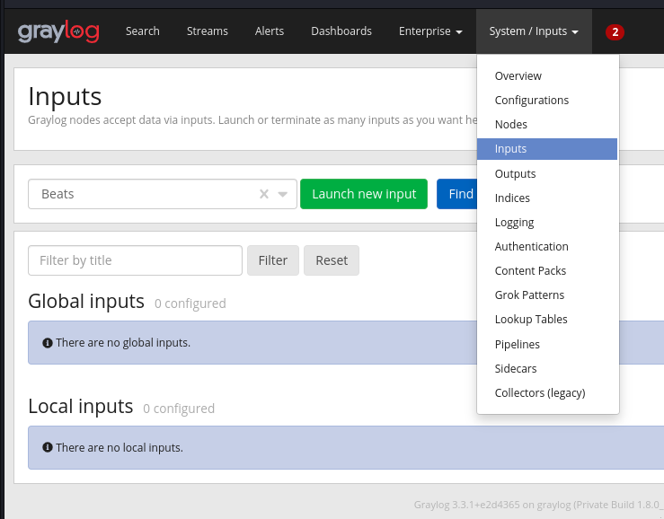
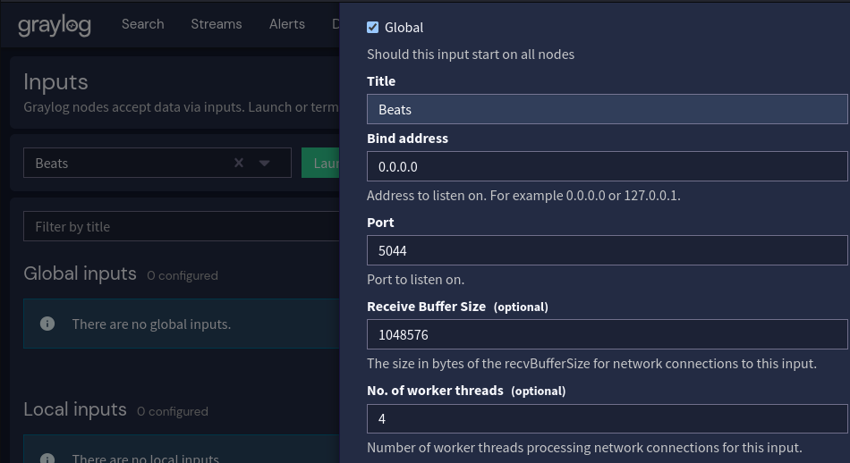
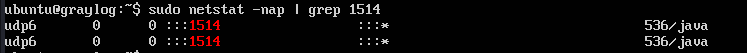
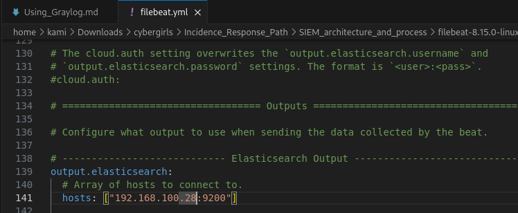

# Using Graylog SIEM tool
- Here, we are using graylog v3.3 .ova tool
- Install the appliance in virtualbox
- Power it up, log in and take note of the admin password which you will use to login to the Graylog server with the given IP address
- Edit the "network" settings of the "graylog" machine. In the "Advanced" settings, set the **Promiscuos Mode** to "Allow all" option and click "OK" 
- Common commands used to avoid errors:
    - *sudo systemctl restart elasticsearch* Elasticsearch handles the indexing of the data. It uses port 9300
    - *sudo systemctl restart mongod* MongoDB stores the configuration settings that have to be stored for the application for the SIEM to work. It uses port 27017
    - *sudo systemctl restart graylog-server* if the Graylog web page is unresponsive
- To see ports running
    - *sudo netstat -nap | grep <port>* e.g grep 9000
        - Port 9000 is the port running Graylog API

## Data Collection
- Go to the "Systems/Input" tab and select "Inputs" 
- In the dropdown bar, select **Beats** and click "Launch new input" 
- Tick the "Global" checkbox. What this does is that if we have multiple Graylog systems collecting data, this sets for all systems to be configured to listen on this port
- Give it a Title then click "save"  
- Do the same by adding another input from dropdown bar called **Syslog UDP** and repeat the process
- Under the port section for "Syslog UDP", you need to put a different port instead of the default 514 which is the recognized port for Syslog e.g 1514 then click "save". 
    - The issue is that in Linux systems, in order to bind to any port below 1024, you have to be running as the Root user but Graylog does not run as the Root user but as the Graylog user hence if we don't change to anything above 1024, we won't be able to listen for traffic
- If we check the port running, we don't see 1514 because it is UDP which actually doesn't have a port that it's listening on unless you specifically grep for it e.g *sudo netstat -nap | grep 1514* 
- Download "Winlogbeat" for Windows OS or "Filebeats" for Linux OS
- Extract the files from the zip and edit file.yml file at the "Output Logstash" and edit the host connected to be the IP address of the Graylog server 
- ELK Stack: 
    > Elastic Search was effectively the database that index all the data and allows you to search end user data
    > Logstash was a collector
    > Kibana was a GUI to user you data
- Go to "gpedit" to update the different policies to log additional data

## Data Processing
- Let's search for "logon" 
- Create streams for the different data structures e.g CEF Stream, JSON Stream, Key-Value Stream
    - Give it a name/title and a description, click save then "Enable" it
- Go to "System" tab then choose "Pipelines"
    - Create 4 pipelines by clicking "Add new pipeline", give it a title and description then click save
    - Select one and "Edit connections" and choose "All messages"
        1. Starter Pipeline- the starting pipeline
        2. Key-Value pipeline
- Click on "Manage Rules" then "Create Rule". Create 8 of them
- Go back to "Starter Pipeline" and Edit "Stage 0" 
    - In the "Stage rules" dropdown, choose "Our very first rule" and save
- Click on the "Simulator", take the Key-Value data sample and paste it in the "Raw message" section
    - In the "Message Codec" section, choose "Raw string" then click "Load Message"
- Then go back to "Starter Pipeline" and Edit "Stage 0"  then add another rule "Our very second rule" then repeat the previous process with the same data sample
- Go to "Key-Value" Pipeline to add another rule "Our very third rule". Edit "Stage 0" and click the "Simulator". Repeat the message loading process. Add the fourth rule "Our very fourth rule"
- The reason why the 4th rule has Country["0"] is because we have one capture group, the default numbering starts at zero 
- For the other data samples with different data structures from the previous sample
- Then go to the "Starter Pipeline" and add the fifth rule "Our very fifth rule"
- In the "JSON Pipeline" add the sixth rule "Our very sixth rule" then repeat the same procedure with message loading
- For the CEF data, we will go back to the "Starter Pipeline" then add the seventh rule "Our very seventh rule"
    - Go to the "CEF Pipeline" and add the eighth rule "Our very eighth rule". Load the message in the "Simulator" tab and load the CEF data
- Check the "Rules quick reference" guide to know how to define the functions