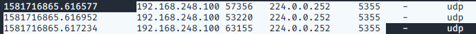

## Project 1 Incidence Response Outline
### Things we know so far
- The compromised machine is at 192.168.248.100
- Upon using Zeek to filter the for this IP address, we notice that:
    - There is communication between 192.168.248.100:5353 and 224.0.0.251:5353 over UDP
        - 
    - There is communication between 192.168.248.100 and 192.168.248.255 both on port 137 UDP
    - There is communication between 192.168.248.100:49807 and 224.0.0.252:5355 over UDP
    - There is communication between 192.168.248.100:56285 and 239.255.255.250:1900 over UDP
    - There is communication between 192.168.248.200:4444 and 192.168.248.100:49789 over TCP
    - There is communication between 192.168.248.200:4444 and 192.168.248.100:49792 over TCP
    - There is communication between 192.168.248.200:7777 and 192.168.248.100:49793 over TCP
    - There is communication between 192.168.248.200:58853 and 192.168.248.100:54706 over UDP