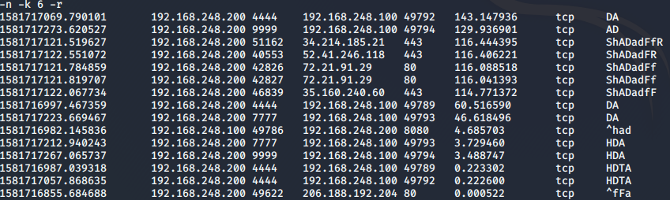
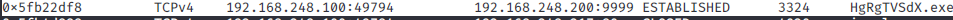

# Project 1: Respond to an Incident Involving an Employee Being Compromised Using Tools to Practice Penetration Testing

## Scenario 
This report details the response to an incident where an employee's system was compromised while practicing penetration testing using a virtual machine (VM) from a compromised website. The incident response phases include detection, investigation, containment, eradication, recovery, and lessons learned.

## Detection and Investigation
- The compromised machine IP address is 192.168.248.100

### Memory and Traffic Analysis using:
#### (i) Zeek
- Using Zeek command to filter the for this IP address in the Connections log
    *sudo zeek-cut < conn.log ts id.orig_h id.orig_p id.resp_h id.resp_p duration | grep 192.168.248.100*
    1.  There is communication between 192.168.248.100:5353 and 224.0.0.251:5353 over UDP
        - There is still communication between 192.168.248.100 and 224.0.0.251 whose Destination port is still 5353 but the Source ports vary with each connection 
        - There is communication between 192.168.248.100:137 and 192.168.248.255 :137 over UDP
        - There is communication between 192.168.248.100:49807 and 224.0.0.252:5355 over UDP
        - There is communication between 192.168.248.100:56285 and 239.255.255.250:1900 over UDP
        - There is communication between 192.168.248.200 and 192.168.248.100 both on different ports and some are TCP while others are UDP
    2. There are connections whose durations are longer. Let's sort them in descending order to view them: *sudo zeek-cut < conn.log ts id.orig_h id.orig_p id.resp_h id.resp_p duration | grep 192.168.248.100 | sort -n -k 6 -r*
        - We see that the connection between 192.168.248.200 and 192.168.248.100 has the highest duration which probably means data exfiltration might be taking place!
        - Since it is via TCP, let's see the handshake:
            *sudo zeek-cut < conn.log ts id.orig_h id.orig_p id.resp_h id.resp_p duration history| grep 192.168.248.100 | grep tcp | sort -n -k 6 -r*
        - From the output, it is seen that indeed during the first two highest connections, there was data being sent from 192.168.248.200 to 192.168.248.100 in the first connection then in the second connection 192.168.248.100 sent back some data to 192.168.248.200 after completing the handshake
- Let's look at the http.log file to see which domain/host names the victim might have visited prior or during the incident
    *sudo zeek-cut < http.log host uri id.orig_h id.orig_p id.resp_h id.resp_p | grep 192.168.248.200 *
    
- From the output, it seems that 192.168.248.200 is on domain "ocsp.digicert.com" which may be a red flag based on the information that some of the iT personnel did a Certified Ethical Course, the exam should be OSCP not OCSP but let's continue investigating in Wireshark

#### (ii) Wireshark
- Let's filter for communication between IP address 192.168.248.200 and 192.168.248.100.  

- From the output, after the TCP handshake, there is a GET request from 192.168.248.100 to 192.168.248.200 for a file called **aa**. 
- Follow the TCP stream, it is seen that the file is a **JavaScript Heap Exploitation Library**

- As we look at other packets, there is a read request for a **ghost.exe** file from 192.168.248.100. Which when opened, it seems encrypted along with the words "This program cannot be run in DOS mode" which is an indicator that this could be the malware
 

- We have extracted two files that may be malware "ghost.exe" and "USERTrustRSAAddTrustCA.crt"
- Since we can see there are other logs pertaining to Digital certificates e.g x509.log, this means the malware most probably was as a result of a corrupt Digital certificate
- When we upload the files to Hybrid Analysis, we get that:
    - "ghost.exe" is a Backdoor, Trojan which means that this was the malware 
        
    - "USERTrustRSAAddTrustCA.crt" is unknown meaning this certificate may be safe but let's go to memory analysis using Volatility
        

#### (iii) Volatility
- We analyze the "project1.raw" file which is the memory dump file of the compromised machine
- Let's determine the type of Operating System of the compromised machine using the command
    *sudo volatility -f project1.raw imageinfo*
    - It is seen that the machine is a Windows 7SP x86, the date and time when the memory image was captured 
    

- Now that we have the profile, let's determine what processes were running at the time of memory capture and which were the Parent or Child processes
    *sudo volatility -f project1.raw --profile=Win7SP0x86 pstree*
    - There are several interesting things:
        1. We have identified where the "ghost.exe" process was running and it was a child process of the "cmd.exe" process. We also see that "ghost.exe" is the parent process of "eDqYEC.exe" 
        2. There is a "cmd.exe" process which is a child process of "iexplore.exe" process which is normal cases, it is not logical for a browser to initiate a CMD process legally 
        3. There are also wierd files names such as "HgRgTVSdx.exe", "tior.exe", "mXvtj.exe"  
        
- Let's find out more on the files. Let's extract them using their process ID(pid) and the procdump plugin 
    *sudo volatility -f project1.raw --profile=Win7SP0x86 procdump -D ~/project1/output -p 2472*
    - "eDqYEC.exe", uploaded it on Hybrid Analysis and it shows it is a trojan 
    - "tior.exe" on Virustotal has been detected as malicious. When doing an online search, it is seen that it is a Metasploitable framework exploit for Windows 7
    - "mXvtj.exe" is labeled as malicious
    - "HgRgTVSdx.exe" is seen as malicous shellcode

## Questions
- Using these artifacts, answer the following questions. You will need to use tools like Wireshark, Zeek, and Volatility to answer these questions:

1. **What do you think is the ip address of the virtual machine hosting the malicious website i.e. origin of the attack?** In the Wireshark traffic analysis, there are connections to the DVWA which is a web application made intentionally vulnerable for Pentesting purposes. Its IP address is *192.168.248.217*

2. **What ip address do you think ultimately is the eventual attackers ip address?** From the analysis done, it is seen that the attacker's IP address is 192.168.248.200
3. **Do there appear to be any malicious processes running on the suspected compromised device currently?** yes, the processes include: eDqYEC.exe, tior.exe, mXvtj.exe, HgRgTVSdx.exe
4. **If there are, does it appear they have any active connections?** by running 
*sudo volatility -f project1.raw --profile=Win7SP0x86 netscan*

- The file "tior.exe" is not seen to be connected to any port
5. **If there are active connections to any malicious processes, where are connections going to and what port are they connecting to?**
7. **Do you think there’s any reason to believe the attacker had system level privilege at any point?** tior.exe is normally results in privilege escalation and we can check for signs of privilege escalation by analyzing the Security Identifiers (SIDs) of processes in a memory dump. We look at SID S-1-5-18 because it has system-level privileges
*sudo volatility -f project1.raw --profile=Win7SP0x86 getsids | grep S-1-5-18*

8. **List what you would consider to be IoC’s for this attack.**
    1. Communication between the compromised machine with other machines for a long duration
    2. Unknown processes with connections established to a specific machine
9. **What IoC’s might you look for on the rest of the network?**
    1. Check if other devices are communicating with devices in the 192.168.248.0/24 subnet using Nmap scan 
10. **What time (time and date stamp) was the first connection between the threat actor and the victim?**
change the time format from seconds to Date and Time in the "View" tab. The first connection is the SYN packet being sent from 192.168.248.100 to 192.168.248.200 which the date and time is 14 Feb 2020
